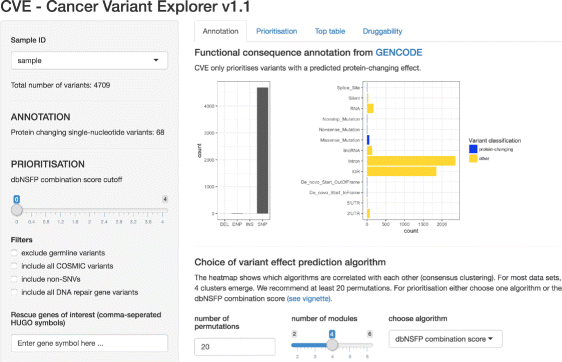

<br>

### Cancer Variant Explorer (CVE)

In my Master thesis in Computational Biology at the Cancer Research UK Institute, Cambridge with Charlie Massie and Nitzan Rosenfeld, I set out to develop an interactive variant prioritisation tool for precision cancer medicine. The result was the Cancer Variant Explorer (CVE), an R package that uses the Shiny framework to interactively explore and prioritize variants.

--> [CVE package @ Bioconductor](https://bioconductor.org/packages/release/bioc/html/CVE.html)  
--> [CVE publication @ BMC Medical Genomics](https://bmcmedgenomics.biomedcentral.com/articles/10.1186/s12920-017-0261-6) 

<br>

```{r, out.width = "600", echo=FALSE}

```

