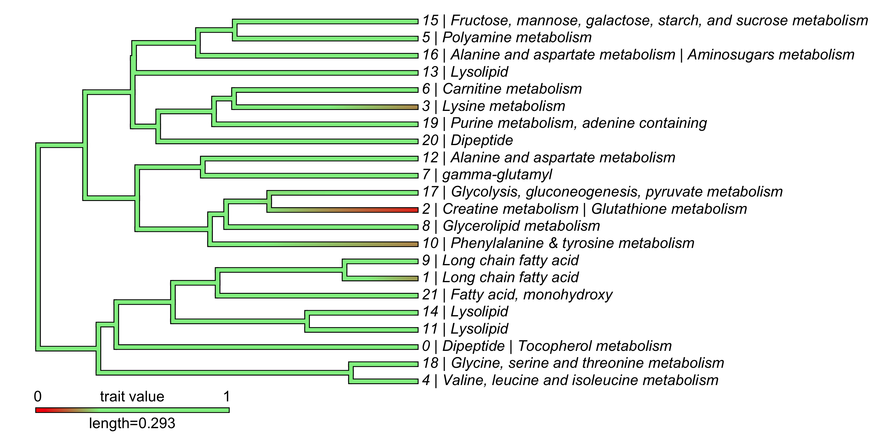

<br>

### MetaboDiff

Comparative non-targeted metabolomics comes of age through an increasing number of commercial vendors offering reproducible high-quality metabolomic data for translational researchers outside the mass spectrometry field. The MetaboDiff packages aims to provide a low-level entry to differential metabolomic analysis by starting off with the table of relative metabolite quantifications provided by commercial vendors or core facilities.

--> [MetaboDiff package @ GitHub](https://github.com/andreasmock/MetaboDiff)

```{r, out.width = "600", echo=FALSE}

```

