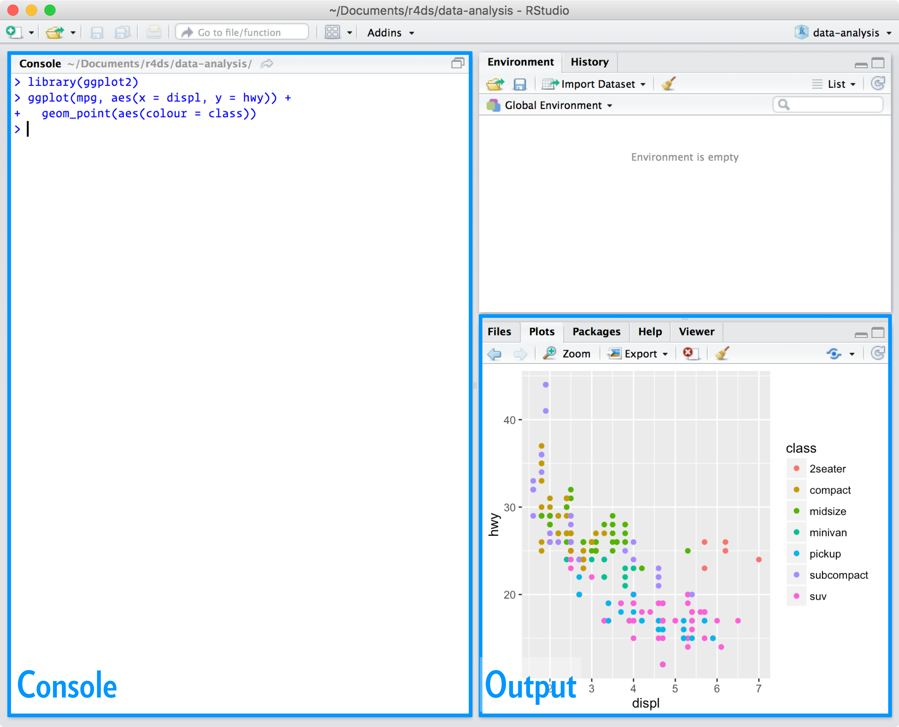

```{r setup, include=FALSE}
knitr::opts_chunk$set(echo = TRUE)
library(wordcloud)
library(tidyverse)
load(url("http://andreasmock.github.io/data/hnscc.RData"))
library(gdata)
library(survival)
library(survminer)
hnscc$vital_status[hnscc$vital_status=="DECEASED"] = 1
hnscc$vital_status[hnscc$vital_status=="LIVING"] = 0
hnscc$vital_status = as.numeric(hnscc$vital_status)
hnscc$g = hnscc$tumor_stage
fit = survfit(Surv(days_to_death, vital_status) ~ g, data=hnscc)
```

## Translationale Onkologie 2018

```{r, echo=FALSE, warnings=F, message=F, fig.align='center', fig.width=7, fig.height=7}
words = c("Data Science","Precision", "Big Data","Personalized","Systems Biology","Synthetic","Cloud","Apps","E-Health","Prediction","Prevention","Translation","Omics","High-Throughput","Seq","Machine Learning","Gene Editing","Immunotherapy","Virotherapy")
set.seed(8)
freq = c(7,5,1,1,1,2,3,4,4,5,3,3,3,2,2,4,3,4,3)
wordcloud(words=words,freq=freq,min.freq = 1,
          max.words=200, random.order=FALSE, rot.per=0.5, 
          colors=brewer.pal(8, "Dark2"))
```

## Was ist R?

- `R` ist eine **freie Programmiersprache** für statistische Berechnungen und Grafiken.
-  Obwohl `R` bereits alt ist (Erscheinungsjahr 1993) gilt diese als **Standardsprache** für statistische Problemstellungen in Wirtschaft und Wissenschaft
- $>$ **11.000 Formelsammlungen** für spezifische Fragestellungen (sog. Pakete)
- Hoch-qualitative und individuelle **Grafiken** - viele Wissenschaftler benutzen `R` nur hierzu
- Sowohl `R`, als auch alle Pakete sind **kostenlos**!!

## RStudio

Grafische Benutzeroberfläche und Entwicklungsumgebung für `R`

{width=300px}

R for Data Science, Hadley Wickham & Garrett Grolemund 2016


## Step-by-step Code

```{r, warning=FALSE}
ggplot(hnscc, aes(x=reorder(neoplasm_site,age,FUN=median),
                  y=age,color=neoplasm_site)) + 
    geom_boxplot() + coord_flip() +
    guides(color=FALSE) + xlab("")
```

## Step-by-step Code

```{r, eval=FALSE}
fit = survfit(Surv(days_to_death, vital_status) ~ g, data=hnscc)
```

```{r, warning=FALSE}
ggsurvplot(fit, hnscc, legend="right")
```

## Hands-On Praktikum: Angewandte Datenanalyse mit `R`

### http://andreasmock.github.io/teaching

>

**Kurszeiten (K1, NCT 1.OG)**

- 05.06.2018 - 17:00 - 18:30 Uhr
- 12.06.2018 - **18:00 - 19:30 Uhr**
- 26.06.2018 - 17:00 - 18:30 Uhr

**Kursinhalte**

- Tag 1: Einführung in Programmierung mit R 
- Tag 2: Datentransformation und -visualisierung
- Tag 3: Import von eigenen Daten und Datenmodellierung 


