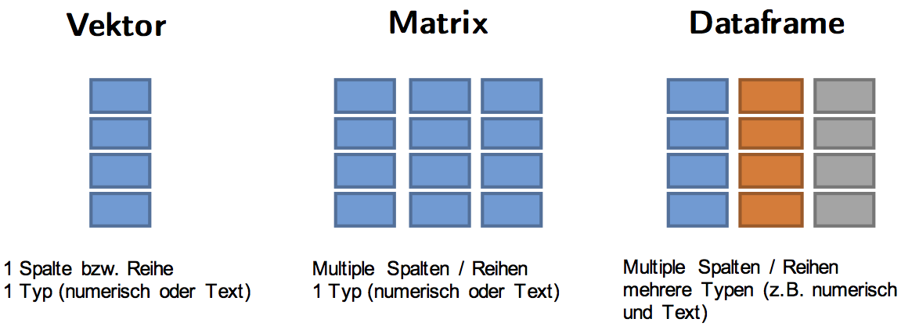

```{r setup, include=FALSE}
knitr::opts_chunk$set(echo = TRUE)
library(survival)
library(survminer)
library(tidyverse)
load(url("http://andreasmock.github.io/data/hnscc.RData"))
```

## Ablauf - Tag 2

- Datentransformation mit `dplyr`
- Datenvisualisierung mit `ggplot2`
- Überlebenszeitanalyse mit `survminer`

{width=300px}

## Erweiterung der R Objektfamilie

{width=400px}

- **Faktor**: spezielle Unterform eines Vektors für kategoriale Variablen. Ein Faktor fasst die Kategorien (= Levels) zusammen.

```{r}
# Vektor
head(hnscc$grade)

# Faktor
head(as.factor(hnscc$grade))
```


## Tibbles - moderne Dataframes

```{r}
class(hnscc)
```

Der `hnscc` Datensatz ist eigentlich streng genommen kein Dataframe, sondern ein sogenannter Tibble, die moderne Weiterentwicklung eines R Dataframes.

```{r}
hnscc
```

## Tibbles - moderne Datenframes

Im Vergleich dazu der Output eines "normalen" Dataframes. In Übung 3 werdet ihr die Unterschiede herausarbeiten.

```{r}
head(as.data.frame(hnscc))
```


# Datentransformation mit `dplyr`

## Session starten

HNSCC Datensatz laden.

```{r}
load(url("http://andreasmock.github.io/data/hnscc.RData"))
```


**Warum Datentransformation?** Oftmals sind wir nur an Teilmengen eines Datensatzes interessiert, bzw. möchten Proben nach verschiedenen Merkmalen zusammengruppieren. 

Die Funktionen zur Datentransformation sind innerhalb des "Tidyverse" im `dplyr` Paket zu finden. Habt ihr das `tidyverse` Paket geladen, so wird automatisch auch das `dplyr` Paket geladen.

```{r}
library(tidyverse)
```


## Datentransformation mit `dplyr` - eine Übersicht

|Transformation| Funktion| 
|-------|-------|
|Zeilen filtern|`filter()`|
|Zeilen sortieren|`arrange()`|
|Spalten selektieren|`select()`|
|Spaltennamen umbenennen|`rename()`|
|Neue Spalten hinzufügen|`mutate()`|
|Gruppenweise transformieren|`group_by()` & `summarize()`|
|Transformationen kombinieren|pipe Funktion `%>%`|

## Zeilen filtern mit `filter()`

Die Funktion `filter()` ermöglicht es uns ein Subset aus den Zeilen auszuwählen. Das erste Argument ist das Objekt, die weiteren Argumente sind die Spalten, wonach wir filtern möchten.

```{r}
young <- filter(hnscc, age<50)

young
```

## Zeilen filtern mit `filter()`

```{r}
larynx <- filter(hnscc, neoplasm_site=="Larynx")

larynx
```

## Zeilen filtern mit `filter()` 

**Logische Operatoren** 

Die doppelten Gleichheitszeichen entsprechen der Frage: Ist der Eintrag in `neoplasm_site = "Larynx"`. Das Resultat der Frage ist ein Vektor mit den Informationen `TRUE` oder `FALSE` pro Eintrag eines Vektors.

```{r}
table(hnscc$neoplasm_site=="Larynx")
```

Die Notation um alle Sites außer Larynx zu filtern ist, ein Ausrufezeichen vor den Ausdruck zu setzen:

```{r, eval=FALSE}
filter(hnscc, !neoplasm_site=="Larynx")
```

Mehrere Sites können wie folgt ausgewählt werden:

```{r, eval=FALSE}
filter(hnscc, neoplasm_site %in% c("Tonsil", "Oral Tongue", "Hard Palate"))
```


## Zeilen filtern mit `filter()`

Im Filterprozess können Informationen aus beliebig vielen Spalten miteinander kombiniert werden.

```{r}
young_larynx <- filter(hnscc, age<50, neoplasm_site=="Larynx")

young_larynx
```

## Zeilen sortieren mit `arrange()`

Die Funktion `arrange()` sortiert Zeilen nach Spalteninformationen.

```{r}
arrange(hnscc, grade)
```

## Zeilen sortieren mit `arrange()`

Hierbei kann wie auch beim Filtern eine Sortierung in mehreren Schritten erfolgen.

```{r}
arrange(hnscc, age, grade)
``` 

## Spalten selektieren mit `select()`

```{r}
select(hnscc, days_to_death, vital_status)
```

## Spalten selektieren mit `select()`

Umgekehrt können auch Spalten ausgeschlossen werden

```{r}
select(hnscc, -c(id,age))
```

## Spaltennamen umbenennen mit `rename()`

```{r, eval=FALSE}
rename(hnscc, barcode=id)
```

```{r, echo=FALSE}
dplyr::rename(hnscc, barcode=id)
```

## Neue Spalten hinzufügen mit `mutate()`

```{r}
hnscc <- mutate(hnscc, years_to_death=(days_to_death/365))

summary(hnscc$years_to_death)
```

## Gruppenweise transformieren `group_by()` und `summarize()` 

```{r}
by_site <- group_by(hnscc, neoplasm_site)

summarize(by_site, mean_age=mean(age))
```

## Transformationen kombinieren mit der pipe Funktion `%>%`

```{r}
hnscc  %>%
    filter(!neoplasm_site %in% c("Base of Tongue","Oral Tongue")) %>% 
    group_by(neoplasm_site) %>%
    summarize(count=n(),
              mean_age=mean(age))
```

# Datenvisualisierung mit ggplot2

## Funktionsweise der `ggplot` Funktion

Leere Leinwand. `age` auf der x-Achse und `days_to_death` auf der y-Achse.

```{r}
ggplot(hnscc, aes(x=age, y=days_to_death))
```

## Funktionsweise der `ggplot` Funktion

```{r, eval=FALSE}
ggplot(hnscc, aes(x=age, y=days_to_death))
```

Mit den sogenannten Aesthetics `aes` definieren wir die Dimensionen an Informationen, die wir im Plot darstellen möchten. 

Dieser leeren Leinwand werden nun sogenannte geoms hinzugefügt, z.B. 
`geom_point` für einen Dotplot.

```{r, eval=FALSE}
ggplot(hnscc, aes(x=age, y=days_to_death)) +
    geom_point()
```

## Dotplot

```{r}
ggplot(hnscc, aes(x=age, y=days_to_death)) +
    geom_point()
```

## Boxplot

```{r}
ggplot(hnscc, aes(x=grade, y=pack_years)) + 
    geom_boxplot() 
```

## Histogramm

```{r}
ggplot(hnscc, aes(x=age)) +
    geom_histogram()
```

## Density plot

```{r}
ggplot(hnscc, aes(x=age)) +
    geom_density()
```

## Transformation für Barplot

```{r, fig.width=3, fig.height=2}
hnscc  %>%
    group_by(neoplasm_site) %>%
    summarize(mean_age=mean(age)) %>%
    ggplot(aes(x=reorder(neoplasm_site,mean_age),y=mean_age)) +
    geom_bar(stat="identity") +
    coord_flip() +
    xlab("anatomical site") +
    ylab("mean age")
```

## Aesthetics 

Bisher haben wir als aesthetics nur die x- und y-Achse verwendet. `ggplot2` bietet jedoch noch weitere Dimensionen von Daten als aesthetics zu definieren

## Aesthetic - color

Coloring - kategoriale Variable neoplasm site.

```{r, fig.width=5}
ggplot(hnscc, aes(x=age, y=days_to_death, color=neoplasm_site)) + 
    geom_point() +
    guides(color=guide_legend(ncol=2))
```

## Aesthetic - color

Coloring - numerische Variable packyears.

```{r}
ggplot(hnscc, aes(x=age, y=days_to_death, color=pack_years)) + 
    geom_point()
```

## Aesthetic - size

```{r}
ggplot(hnscc, aes(x=age, y=days_to_death, size=pack_years)) + 
    geom_point()
```

## Aesthetic - shape

```{r}
ggplot(hnscc, aes(x=age, y=days_to_death, shape=grade)) + 
    geom_point()
```

## Facetting

Über die Aesthetics hinaus gibt es die Möglichkeit Plots nach kategorialen Variablen zu stratefizieren.

```{r, fig.width=6}
ggplot(hnscc, aes(x=age, y=days_to_death, color=neoplasm_site)) + 
    geom_point() +
    facet_wrap(~alcohol) +
    guides(color=guide_legend(ncol=2))
```


# Überlebenszeitanalyse mit survival and survminer

## Überlebenszeitanalyse

Kaum eine klinische Studie kommt ohne Überlebensanalysen aus. Deshalb sollte die sachkundige Durchführung und Interpretation dieser zum Rüstzeug jedes Mediziners gehören.

- **Hazard Ratio (HR)**: Relative Wahrscheinlichkeit zwischen den Gruppen innerhalb eines Zeitintervalls (z.B. innerhalb eines Monats oder Jahres) ein Event zu haben (z.B. Tod oder Progress)
- **Censor**: 1 = Event eingetroffen (z.B. Tod oder Progress), 0 = Event noch nicht eingetroffen
- **univariat**: Es wird nur der Einfluss eines Faktors (z.B. Geschlecht) auf den Endpunkt (z.B. Gesamtüberleben) untersucht.
- **multivariat**: Es wird nur der Einfluss mehrerer Faktoren auf den Endpunkt untersucht.
- **log-rank Test**: Statistischer Test zum Vergleich der beiden Gruppen in der Überlebenszeitanalyse.


## Überlebenszeitanalyse

Pakete installieren und laden

```{r, eval=FALSE}
install.packages("survival")
install.packages("survminer")

library(survival)
library(survminer)
```

## Überlebenszeitanalyse

Für eine vergleichende Überlebenszeitanalysen benötigen wir drei Informationen: 

1. die Zeit bis zu einem Event (z.B. Tod oder Progress) 
2. der Censor (binäre Info ob Event eingetroffen ist, z.B. 1 = tod, 0 = lebend)
3. die Gruppenzugehörigkeiten (diskrete oder kontinuierliche Daten)

```{r}
# 1. Zeit bis zum Tod
summary(hnscc$days_to_death)

# 2. Censor
table(hnscc$vital_status)

# 3. Gruppenzugehörigkeiten
colnames(hnscc)[-c(1,4,11)]
```

## Kaplain-Meier-Kurve

Der Klassiker der Visualisierung von Überlebenszeitanalysen ist die so genannte Kaplan-Meier-Kurve. Der folgende Codechunk visualisiert den Einfluss des Geschlechts auf den Endpunkt Gesamtüberleben.

```{r}
# Overall survival (OS) ist bereits richtig formatiert (als integer in Tagen)
# Censor muss noch richtig formatiert werden (0 = zensiert, 1 = gestorben)
hnscc_survival <- hnscc %>%
    dplyr::rename(OS=days_to_death) %>%
    mutate(Censor = as.factor(vital_status))

levels(hnscc_survival$Censor) <- c(1,0)    

hnscc_survival$Censor = as.numeric(hnscc_survival$Censor)

# Der folgende Code erstellt ein survival Objekt
fit <- survfit(Surv(OS, Censor)~gender, data=hnscc_survival)
```

## Kaplain-Meier-Kurve

```{r, fig.width=4}
ggsurvplot(fit, hnscc_survival, risk.table = FALSE, 
           pval=TRUE, tables.height=0.25,
           palette = c("goldenrod","skyblue4"),
           xlab="Time (months)")
```

## Weiterführende Informationen

Datentransformation mit `dplyr`  
Link: [http://r4ds.had.co.nz/transform.html](http://r4ds.had.co.nz/transform.html)

Datenvisualisierung mit `ggplot2`  
Link: [http://r4ds.had.co.nz/data-visualisation.html](http://r4ds.had.co.nz/data-visualisation.html)

# Programmer + Coffee -> Code