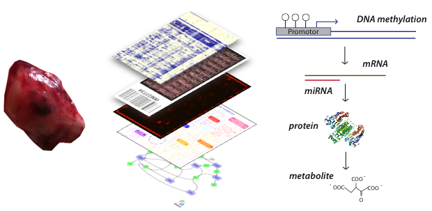

<br>

### Integrated Kinomics 
*with Stefan Fröhling, NCT Heidelberg*

There is an unfulfilled potetial of transcriptomic data for precision oncology

<br>

### Oncometabolism


<br>

### Systems biology of head and neck cancers

```{r, out.width = "500", echo=FALSE}

```

<br>

### Medical Informatics

Healthcare is one of the last sectors of public life that is not digitalized to a major extent. The lack of powerful hospital IT infrastructures is not only constraining productivity of healthcare employees, but also poses a major bottleneck for data-hungry biomedical research and the pursuit for precision oncology. To this end, I am developing physician-centered software solutions.

